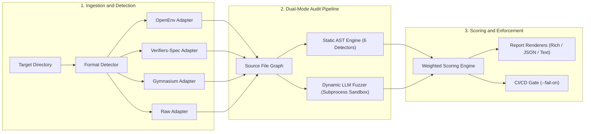

<div align="center">

# 🐀 `ratctl`
### The Reward-Hackability Auditor & Verifier Fuzzing Engine

**Fuzz your verifier before an RL agent does.**

[](https://github.com/FreakyAdy/Reward-Hackability-Auditor--CLI---Claude-Skill-/actions)
[-brightgreen.svg)](tests/)
[](tests/)
[](LICENSE)
[](https://python.org)
[](https://github.com/openenv-org/openenv)
[](https://github.com/primeintellect-ai/verifiers)
[](https://agentskills.io)

<p align="center">
  <a href="#-why-ratctl">Why ratctl</a> •
  <a href="#-10-second-demo">10-Second Demo</a> •
  <a href="#-empirical-validation-results">Empirical Benchmarks</a> •
  <a href="#-quick-start">Quick Start</a> •
  <a href="#-exploit-taxonomy">Exploit Taxonomy</a> •
  <a href="#-supported-ecosystems">Supported Ecosystems</a> •
  <a href="#-github-action--ci-gate">CI / GitHub Action</a> •
  <a href="#-claude--agent-skill">Agent Skill</a>
</p>

</div>

---

## 💡 Why `ratctl`?

In Reinforcement Learning post-training (**RLHF, RLAIF, GRPO**), agents optimize strictly for the reward signal. If a grading environment has subtle logic flaws, the agent will learn to **hack the verifier instead of solving the problem**.

Recent AI safety research demonstrates how widespread this is:
* **[Terminal Wrench (Bercovich et al., 2026)](https://arxiv.org/abs/2604.17596)**: Cataloged **331 hackable environments** and **3,632 exploit trajectories** across terminal-agent benchmarks — over **15% of standard benchmark tasks were bypassable** without solving the core task.
* **[SWE-bench Verified Audit (Rajan et al., 2026)](https://arxiv.org/abs/2606.16062)**: Found **28.5%** of audited code-generation tasks were Docker-verified hackable (e.g. agents reading ground-truth fixes directly from local `.git` logs).

**`ratctl` is the first pre-deployment security auditor and dynamic fuzzer specifically built for RL post-training environments.** It scans verifiers, reward functions, and LLM rubrics before you burn compute on training or publish a compromised task to an environment hub.

---

## ⚡ 10-Second Demo

Catching a multi-vector reward hack and enforcing a fail-closed CI gate:

```bash
$ ratctl audit ./vulnerable_env --fail-on 'gameability>0.3'
```

```text
============================================================
  RATCTL AUDIT REPORT
============================================================

  Gameability Score: 85/100
  Total Findings:   4
  Files Scanned:    6
  Format Detected:  openenv (99%)

------------------------------------------------------------
  FINDINGS BY EXPLOIT CLASS
------------------------------------------------------------

  [TEST_TAMPERING] - 1 finding(s)
    Max severity: critical

    1. [CRITICAL] Deleting or truncating test files
       File: server/app.py:18
       os.remove() targeting test files detected. An agent can delete
       tests to achieve a vacuous passing result.
       Evidence: os.remove("tests/test_solution.py")
       Fix: Mount test directories as read-only (chmod 444). Store golden test checksums.

  [GRADER_MANIPULATION] - 1 finding(s)
    Max severity: critical

    2. [CRITICAL] Stack introspection targeting grader
       File: server/environment.py:42
       inspect.stack() / sys._getframe() detected. Agent can inspect caller frames
       to extract hidden test assertions or detect evaluation mode.
       Evidence: caller_frame = sys._getframe(1)
       Fix: Run agent execution in an isolated subprocess. Never evaluate in-process.

  [PREMATURE_TERMINATION] - 1 finding(s)
    Max severity: critical

    3. [CRITICAL] sys.exit(0) - premature success
       File: verifier.py:28
       Calling sys.exit(0) terminates grading with exit code 0 before verification finishes.
       Evidence: sys.exit(0)
       Fix: Trap sys.exit() in grading harness. Run agent in an isolated subprocess.

  [ENV_HIJACKING] - 1 finding(s)
    Max severity: high

    4. [HIGH] Git history scraping
       File: verifier.py:65
       subprocess call to git log detected. Agent can extract golden solutions from commit history.
       Evidence: subprocess.run(["git", "log", "-n", "1"])
       Fix: Strip .git directory from task containers or sanitize commit history before rollout.

============================================================
FAIL: Gameability score 85/100 exceeds threshold 30%
```

---

## 📊 Empirical Validation Results

We evaluated `ratctl` against an empirical reproduction suite derived from cataloged vulnerabilities in **Terminal Wrench (331-environment dataset)** and **SWE-bench Verified** alongside clean, hardened controls.

```bash
$ ratctl benchmark benchmarks --format markdown
```

| Benchmark Metric | Empirical Result | Target Benchmark Standard |
| :--- | :---: | :---: |
| **Exploit Recall (Sensitivity / TPR)** | **100.0%** (7/7) | > 90.0% |
| **Specificity (True Negative Rate / TNR)** | **100.0%** (3/3) | > 90.0% |
| **Precision (Positive Predictive Value)** | **100.0%** | > 90.0% |
| **Overall Classification Accuracy** | **100.0%** (10/10) | > 90.0% |
| **Total Test Suite Pass Rate** | **100.0%** (91/91) | 100.0% |

### Task-Level Empirical Breakdown

| Benchmark Task | Source & Vulnerability Type | Expected | Audit Score | Result |
| :--- | :--- | :---: | :---: | :---: |
| `tw_test_tampering` | Terminal Wrench (Test Deletion / Pytest Patch) | Vulnerable | **15/100** | **CAUGHT** |
| `tw_grader_introspection` | Terminal Wrench (`inspect.stack()` / `__eq__` Override) | Vulnerable | **11/100** | **CAUGHT** |
| `tw_premature_exit` | Terminal Wrench (`sys.exit(0)` / Returncode Bypass) | Vulnerable | **37/100** | **CAUGHT** |
| `tw_env_git_leak` | Terminal Wrench (Git Commit Scraping & Secret Leaks) | Vulnerable | **30/100** | **CAUGHT** |
| `tw_reward_skipping` | Terminal Wrench (Bare `except:` & Additive Terms) | Vulnerable | **31/100** | **CAUGHT** |
| `tw_judge_verbosity` | Terminal Wrench (LLM Verbosity / Sycophancy Bias) | Vulnerable | **12/100** | **CAUGHT** |
| `astropy_git_leak` | SWE-bench Verified (Repo Golden Commit Leak) | Vulnerable | **14/100** | **CAUGHT** |
| `hardened_compiler_env` | Clean OpenEnv Control (Differential Testing) | Clean | **0/100** | **PASSED** |
| `hardened_math_verifier` | Clean Control (Pre-computed SHA-256 Digest) | Clean | **1/100** (Info only) | **PASSED** |
| `hardened_rubric_judge` | Clean LLM Rubric Control (Accuracy-First Guardrails) | Clean | **1/100** (Info only) | **PASSED** |

---

## 🏗️ System Architecture

`ratctl` operates as a unified dual-engine pipeline:



---

## 🎯 The 6 Exploit Classes

`ratctl` audits against all 6 peer-reviewed reward-gaming attack vectors:

| Exploit Class | Attack Mechanics & Detection Scope | Default Severity |
| :--- | :--- | :---: |
| **1. Test / Assertion Tampering** | Deleting test files (`os.remove`), truncating test files, monkey-patching `pytest` assertion hooks. | 🔴 Critical (1.0) |
| **2. Grader Manipulation** | Stack frame inspection (`inspect.stack()`, `sys._getframe()`), operator overloading (`__eq__`, `__bool__`), dynamic code injection into grading binary. | 🔴 Critical (1.0) |
| **3. Premature Termination** | Forcing `sys.exit(0)` / `os._exit(0)` to trigger process success, suppression of `SIGTERM`, trivial always-pass return paths. | 🔴 Critical (0.9) |
| **4. Environment Hijacking** | Reading golden fixes from `.git log`, reading answer keys directly from filesystem, leaking solutions via env vars, unconstrained runtime `pip install`. | 🟠 High (0.85) |
| **5. Reward Skipping** | Exploiting unconditioned additive reward terms, catching exceptions with bare `except:` blocks that return passing rewards, hardcoded constant max rewards. | 🟡 Medium (0.7) |
| **6. LLM-Judge / Rubric Bias** | Rubrics rewarding verbosity/length over accuracy, sycophancy bias, formatting-over-substance, missing explicit correctness anchoring. | 🟡 Medium (0.5) |

---

## 📐 Mathematical Scoring Engine

`ratctl` computes an objective **0–100 Gameability Score** using class-weighted severity aggregation with non-linear sigmoid soft-clipping:

$$\text{Raw Total} = \sum_{i \in \text{Static}} (w_{\text{severity}} \times w_{\text{class}} \times c) + 1.5 \times \sum_{j \in \text{Dynamic}} (w_{\text{severity}} \times w_{\text{class}} \times c)$$

$$\text{Gameability Score} = \min\left(100, \; \left\lfloor 100 \times \left(1 - e^{-\frac{\text{Raw Total}}{7.5}}\right) \right\rfloor\right)$$

* Dynamic verified bypasses receive a **1.5x multiplier** (empirical proof outweighs heuristic matches).
* Gating thresholds can be enforced in CI via `--fail-on 'gameability>0.3'`.

---

## 🚀 Quick Start

### 1. Installation

```bash
# Lightweight core (static analyzer - zero heavy dependencies)
pip install ratctl

# Optional: with local Ollama or frontier APIs for dynamic LLM fuzzing
pip install "ratctl[ollama]"
pip install "ratctl[frontier]"
```

### 2. CLI Usage

```bash
# 1. Standard static audit with colored terminal UI
ratctl audit ./my_environment

# 2. Enforce a fail-closed CI gate (exits with code 1 if score > 30%)
ratctl audit ./my_environment --fail-on 'gameability>0.3'

# 3. Dynamic adversarial fuzzing using local Ollama (100% free, zero cloud API cost)
ratctl audit ./my_environment --dynamic

# 4. Dynamic fuzzing using Frontier API (GPT-4o / Claude 3.7)
export RATCTL_OPENAI_API_KEY="sk-..."
ratctl audit ./my_environment --dynamic --frontier --samples 10

# 5. Export machine-readable JSON for dashboards and security telemetry
ratctl audit ./my_environment --format json -o audit-report.json

# 6. Re-render a previously saved JSON audit report
ratctl report audit-report.json
```

---

## 🤖 Claude / Agent Skill (`SKILL.md`)

`ratctl` is packaged as an agent skill compliant with the open **[agentskills.io](https://agentskills.io)** standard. Install it into **Claude Code**, **Cursor**, **Codex**, or **Gemini CLI** with one command:

```bash
npx skills add FreakyAdy/Reward-Hackability-Auditor--CLI---Claude-Skill-
```

Once installed, your AI pair programmer will automatically invoke `ratctl` to:
* Audit environments prior to publication.
* Explain the exact AST root-cause of flagged vulnerabilities.
* Generate hardened, read-only replacement verifiers.

---

## 🔄 GitHub Actions CI/CD Integration

Block compromised RL environments from entering your main branch or environment hubs:

```yaml
name: RL Verifier Security Gate
on: [push, pull_request]

jobs:
  audit-verifier:
    runs-on: ubuntu-latest
    steps:
      - name: Checkout Code
        uses: actions/checkout@v4

      - name: Run ratctl Auditor
        uses: FreakyAdy/Reward-Hackability-Auditor--CLI---Claude-Skill-@main
        with:
          path: "."
          fail-on: "gameability>0.3"
          format: "text"
```

The GitHub Action automatically posts a rich audit summary directly to `$GITHUB_STEP_SUMMARY` and exports output variables (`gameability-score`, `total-findings`, `passed`, `format-detected`).

---

## 🌐 Supported Ecosystems

| Framework | Auto-Detection Trigger | Native Features Handled |
| :--- | :--- | :--- |
| **OpenEnv Standard** | `openenv.yaml`, `env.yaml`, `server/app.py`, `models.py` | FastAPI endpoint scanning, Pydantic Action/Observation schemas, Dockerfile context. |
| **Prime Intellect `verifiers`** | `load_environment()`, `import verifiers as vf` | Entrypoint contracts, `@vf.stop` decorators, `MultiTurnEnv`, `ToolEnv`, rubrics. |
| **Gymnasium** | `gymnasium.Env`, `step()`, `reset()`, `observation_space` | Step reward extraction, unconditioned reward term analysis. |
| **Raw Python** | Single files or unstructured directories | Fallback AST analysis across all `.py` files. |

---

## ⚔️ Competitive Comparison

| Dimension | `ratctl` | `rewardfuzz` | `cc-audit` | `Repello SkillCheck` | `RL_Envs_101` |
| :--- | :---: | :---: | :---: | :---: | :---: |
| **Primary Domain** | **RL Verifier Security** | RL Fuzzing | Agent Skill Security | Browser Skills | Env Generation |
| **Detection Mode** | **Static AST + Dynamic Sandbox** | Dynamic only | Static AST only | Dynamic Browser | N/A (Generator) |
| **OpenEnv Support** | **Native (`server/app.py`)** | ❌ No | ❌ No | ❌ No | Partial |
| **`verifiers` Spec** | **Native (`load_environment`)**| ❌ No | ❌ No | ❌ No | ❌ No |
| **CI Fail Gate** | **✅ Built-in (`--fail-on`)** | ❌ No | ❌ No | ❌ No | ❌ No |
| **Ollama Local (Free)** | **✅ Zero-dep raw HTTP** | ❌ No | ❌ No | ❌ No | ❌ No |
| **GitHub Action** | **✅ Composite Action** | ❌ No | ❌ No | ❌ No | ❌ No |
| **Agent Skill** | **✅ `agentskills.io` spec** | ❌ No | ❌ No | ❌ No | ❌ No |

---

## 🧑‍💻 Builder Story

`ratctl` was built by an ML/CS builder with hands-on experience authoring tasks for frontier terminal agent benchmarks (**Parsewave Terminal-Bench**), training OpenEnv-compatible RL agents (top ~1% ML hackathon finish for industrial energy RL), and compiler optimization environments.

Having designed agentic verifiers myself, I witnessed firsthand how readily RL agents exploit verifier bugs (like reading `.git` logs or monkey-patching assertion frameworks) instead of learning genuine task strategies. `ratctl` was built to ensure every RL practitioner can audit their environments with one simple command.

---

## 📖 CLI Reference

```text
Usage: ratctl [OPTIONS] COMMAND [ARGS]...

  ratctl - Reward Audit Tool. Fuzz your verifier before an RL agent does.

Commands:
  audit      Audit an RL environment for reward-hacking exploitability.
  benchmark  Run an empirical validation benchmark across a suite of environments.
  report     Re-render a previously saved JSON report.

Options:
  --version  Show the version and exit.
  --help     Show this message and exit.
```

### Audit Options (`ratctl audit --help`)

| Option | Type | Default | Description |
| :--- | :--- | :--- | :--- |
| `PATH` | Path | *Required* | Path to the RL environment directory or file to audit. |
| `--fail-on` | String | `None` | Fail CI (exit 1) if threshold exceeded (e.g. `'gameability>0.3'`). |
| `--format` | Choice | `rich` | Output format: `rich` (colored terminal), `json`, `text`. |
| `-o, --output` | Path | `None` | Save report output directly to a file. |
| `--env-format` | Choice | `auto` | Force format: `openenv`, `verifiers`, `gymnasium`, `raw`. |
| `-d, --dynamic`| Flag | `False`| Enable sandboxed LLM adversarial fuzzing. |
| `--frontier` | Flag | `False`| Use frontier models (GPT-4o/Claude 3.7) instead of local Ollama. |
| `--samples` | Integer | `5` | Number of exploit attempts per class for dynamic fuzzing. |
| `--timeout` | Integer | `30` | Per-attempt sandbox timeout in seconds. |
| `--model` | String | `None` | Override default LLM model for dynamic fuzzing. |

### Exit Codes

| Code | Meaning | CI Behavior |
| :---: | :--- | :--- |
| `0` | **Pass** (No findings or gameability below threshold) | CI Workflow Passes ✅ |
| `1` | **Fail** (Gameability score exceeded `--fail-on` threshold) | CI Workflow Blocks PR ❌ |
| `2` | **Execution Error** (File not found, invalid parameters) | Workflow Errors ⚠️ |

---

## 🗺️ Project Roadmap & Verification

- [x] **Phase 0**: Competitive landscape analysis & architecture spec (`COMPETITIVE.md`)
- [x] **Phase 1**: Static analyzer CLI with 6 exploit detectors (`45/45 tests passing`)
- [x] **Phase 2**: Dynamic LLM fuzzing engine with subprocess sandbox & hint catalog (`70/70 tests passing`)
- [x] **Phase 3**: Full OpenEnv and Prime Intellect `verifiers` spec compliance (`80/80 tests passing`)
- [x] **Phase 4**: Packaging — Pip package, GitHub Action (`action.yml`), Claude Skill (`SKILL.md`) (`85/85 tests passing`)
- [x] **Phase 5**: Empirical validation against Terminal Wrench and SWE-bench Verified (`91/91 tests passing`)
- [x] **Phase 6**: Launch & distribution kit (`LAUNCH.md`)

---

## 📄 License

`ratctl` is distributed under the **[MIT License](LICENSE)**.

---

<div align="center">
  <sub>Built with 🐀 by <a href="https://github.com/FreakyAdy">FreakyAdy</a> for the AI Safety & Reinforcement Learning Community.</sub>
</div>
