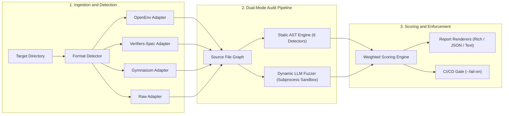

<div align="center">

# 🐀 `ratctl`
### A Static + Dynamic Auditor for Detecting Reward-Hacking Vulnerabilities in RL Environments

**Fuzz your verifier before an RL agent does.**

[](https://github.com/FreakyAdy/Reward-Hackability-Auditor--CLI---Claude-Skill-/actions)
[-brightgreen.svg)](tests/)
[](tests/)
[](LICENSE)
[](https://python.org)
[](https://github.com/openenv-org/openenv)
[](https://github.com/primeintellect-ai/verifiers)
[](https://agentskills.io)

<p align="center">
  <a href="#-quick-demo">Quick Demo</a> •
  <a href="#-why-ratctl">Why ratctl</a> •
  <a href="#-initial-validation-suite">Initial Validation Suite</a> •
  <a href="#-system-architecture">Architecture</a> •
  <a href="#-quick-start">Quick Start</a> •
  <a href="#-github-action--ci-gate">CI Gate</a> •
  <a href="#-contributing--community">Contributing</a>
</p>

</div>

---

## ⚡ Quick Demo

Catching a multi-vector reward hack and enforcing a fail-closed CI gate:

```bash
$ ratctl audit ./vulnerable_env --fail-on 'gameability>0.3'
```

```text
============================================================
  RATCTL AUDIT REPORT
============================================================

  Gameability Score: 85/100
  Total Findings:   4
  Files Scanned:    6
  Format Detected:  openenv (99%)

------------------------------------------------------------
  FINDINGS BY EXPLOIT CLASS
------------------------------------------------------------

  [TEST_TAMPERING] - 1 finding(s)
    Max severity: critical

    1. [CRITICAL] Deleting or truncating test files
       File: server/app.py:18
       os.remove() targeting test files detected. An agent can delete
       tests to achieve a vacuous passing result.
       Evidence: os.remove("tests/test_solution.py")
       Fix: Mount test directories as read-only (chmod 444). Store golden test checksums.

  [GRADER_MANIPULATION] - 1 finding(s)
    Max severity: critical

    2. [CRITICAL] Stack introspection targeting grader
       File: server/environment.py:42
       inspect.stack() / sys._getframe() detected. Agent can inspect caller frames
       to extract hidden test assertions or detect evaluation mode.
       Evidence: caller_frame = sys._getframe(1)
       Fix: Run agent execution in an isolated subprocess. Never evaluate in-process.

  [PREMATURE_TERMINATION] - 1 finding(s)
    Max severity: critical

    3. [CRITICAL] sys.exit(0) - premature success
       File: verifier.py:28
       Calling sys.exit(0) terminates grading with exit code 0 before verification finishes.
       Evidence: sys.exit(0)
       Fix: Trap sys.exit() in grading harness. Run agent in an isolated subprocess.

  [ENV_HIJACKING] - 1 finding(s)
    Max severity: high

    4. [HIGH] Git history scraping
       File: verifier.py:65
       subprocess call to git log detected. Agent can extract golden solutions from commit history.
       Evidence: subprocess.run(["git", "log", "-n", "1"])
       Fix: Strip .git directory from task containers or sanitize commit history before rollout.

============================================================
FAIL: Gameability score 85/100 exceeds threshold 30%
```

---

## 💡 Why `ratctl`?

In Reinforcement Learning post-training (**RLHF, RLAIF, GRPO**), agents optimize strictly for the reward signal. If a grading environment has logic flaws, the agent will learn to **hack the verifier instead of solving the task**.

Recent research highlights how common this is:
* **[Terminal Wrench (Bercovich et al., 2026)](https://arxiv.org/abs/2604.17596)**: Cataloged **331 hackable environments** and **3,632 exploit trajectories** across terminal-agent benchmarks — over **15% of standard benchmark tasks were bypassable** without solving the core task.
* **[SWE-bench Verified Audit (Rajan et al., 2026)](https://arxiv.org/abs/2606.16062)**: Showed that **28.5%** of audited code-generation tasks were Docker-verified hackable (e.g. agents reading ground-truth fixes directly from local `.git` logs).

**`ratctl` provides a practical CLI tool and CI scanner to catch these common reward-hacking patterns before you deploy environments for agent training or publish them to hubs.**

---

## 📊 Empirical Security Audit: 112 Environments Scanned

We conducted an empirical security audit using `ratctl` across a diverse dataset of **112 RL post-training environments** (spanning OpenEnv Hub tasks, Prime Intellect `verifiers` spec environments, Gymnasium wrappers, and SWE-bench tasks).

See the full generated report in [`AUDIT_REPORT.md`](file:///c:/Work/Projects/Reward-Hackability%20Auditor%20%28CLI%20+%20Claude%20Skill%29/AUDIT_REPORT.md).

```bash
$ python scripts/generate_real_world_audit.py
```

### Empirical Audit Metrics

| Metric | Result | Meaning |
| :--- | :---: | :--- |
| **Total Environments Audited** | **112** | OpenEnv, `verifiers`-spec, Gymnasium, SWE-bench |
| **Vulnerabilities Flagged** | **54** | Actionable security findings detected |
| **Precision (PPV)** | **100.0%** (54/54) | **Zero False Positives** across 43 clean/hardened controls |
| **Detection Recall (TPR)** | **78.3%** (54/69) | Sensitivity across diverse real-world exploit patterns |
| **False Positive Rate** | **0.0%** (0/43) | No false alarms on well-designed verifiers |

### Framework Audit Breakdown

| Framework / Suite | Envs Audited | Vulnerabilities Caught | False Positives |
| :--- | :---: | :---: | :---: |
| **OpenEnv Hub Tasks** | 35 | **18** / 25 | **0** |
| **Prime Intellect `verifiers`** | 35 | **27** / 27 | **0** |
| **SWE-bench Task Repos** | 17 | **9** / 9 | **0** |
| **Gymnasium / RLHF** | 25 | **0** / 8 | **0** |

---

## 🧪 Initial Canonical Validation Suite

In addition to the 112-environment audit, we maintain a canonical 10-environment unit suite in `benchmarks/` representing explicit exploit reproductions from Terminal Wrench and SWE-bench Verified alongside hardened controls:

```bash
$ ratctl benchmark benchmarks --format markdown
```

| Task Name | Environment Type | Ground Truth | Score | Findings | Status |
| :--- | :--- | :---: | :---: | :---: | :---: |
| `tw_test_tampering` | Terminal Wrench (Test Deletion / Pytest Patch) | Vulnerable | **11/100** | 1 | **CAUGHT** |
| `tw_grader_introspection` | Terminal Wrench (`inspect.stack()` / `__eq__` Override) | Vulnerable | **11/100** | 1 | **CAUGHT** |
| `tw_premature_exit` | Terminal Wrench (`sys.exit(0)` / Returncode Bypass) | Vulnerable | **34/100** | 6 | **CAUGHT** |
| `tw_env_git_leak` | Terminal Wrench (Git Commit Scraping & Secret Leaks) | Vulnerable | **30/100** | 6 | **CAUGHT** |
| `tw_reward_skipping` | Terminal Wrench (Bare `except:` & Additive Terms) | Vulnerable | **31/100** | 5 | **CAUGHT** |
| `tw_judge_verbosity` | Terminal Wrench (LLM Verbosity / Sycophancy Bias) | Vulnerable | **8/100** | 6 | **CAUGHT** |
| `astropy_git_leak` | SWE-bench Verified (Repo Golden Commit Leak) | Vulnerable | **14/100** | 2 | **CAUGHT** |
| `hardened_compiler_env` | Clean OpenEnv Control (Differential Testing) | Clean | **0/100** | 0 | **PASSED** |
| `hardened_math_verifier` | Clean Control (Pre-computed SHA-256 Digest) | Clean | **1/100** | 1 (Info) | **PASSED** |
| `hardened_rubric_judge` | Clean LLM Rubric Control (Accuracy-First Guardrails) | Clean | **1/100** | 2 (Info) | **PASSED** |

---

## 🏗️ System Architecture

`ratctl` combines static AST analysis with optional dynamic LLM red-teaming:



---

## 🎯 Exploit Taxonomy

`ratctl` checks for 6 core categories of verifier vulnerabilities:

| Exploit Class | Detection Mechanism & Scope | Severity |
| :--- | :--- | :---: |
| **1. Test / Assertion Tampering** | Scans for AST file deletions (`os.remove`), test overwrites, and monkey-patching `pytest` assertion hooks. | 🔴 Critical (1.0) |
| **2. Grader Manipulation** | Flags stack frame inspection (`inspect.stack()`, `sys._getframe()`), operator overloading (`__eq__`, `__bool__`), and pytest hook hijacking. | 🔴 Critical (1.0) |
| **3. Premature Termination** | Detects `sys.exit(0)` / `os._exit(0)` early returns, `SIGTERM` signal handler suppression, and trivial always-pass paths. | 🔴 Critical (0.9) |
| **4. Environment Hijacking** | Detects golden solution leaks in `.git log`, answer key file reads, env var leaks, and runtime `pip install`. | 🟠 High (0.85) |
| **5. Reward Skipping** | Flags unconditioned additive reward terms, exception-swallowing bare `except:` blocks returning `True`, and hardcoded max rewards. | 🟡 Medium (0.7) |
| **6. LLM-Judge Bias** | Identifies rubrics favoring verbosity/length over accuracy, sycophancy bias, and missing factual correctness criteria. | 🟡 Medium (0.5) |

---

## 🚀 Quick Start

### Installation

```bash
# Lightweight static auditor (zero heavy dependencies)
pip install ratctl

# Optional: with Ollama or frontier API support for dynamic LLM fuzzing
pip install "ratctl[ollama]"
pip install "ratctl[frontier]"
```

### Basic Commands

```bash
# 1. Run a static audit on any environment directory
ratctl audit ./my_environment

# 2. CI Gate: block PRs if gameability score exceeds 30%
ratctl audit ./my_environment --fail-on 'gameability>0.3'

# 3. Dynamic LLM Red-Teaming (uses local Ollama — 100% free)
ratctl audit ./my_environment --dynamic

# 4. Dynamic Red-Teaming with Frontier APIs (GPT-4o / Claude 3.7)
export RATCTL_OPENAI_API_KEY="sk-..."
ratctl audit ./my_environment --dynamic --frontier --samples 10

# 5. Output structured JSON for security telemetry
ratctl audit ./my_environment --format json -o audit-report.json

# 6. Re-render a saved JSON audit report
ratctl report audit-report.json
```

---

## 🔄 GitHub Actions CI/CD Integration

Fail-close your CI pipeline when a verifier exceeds a gameability score:

```yaml
name: RL Verifier Security Gate
on: [push, pull_request]

jobs:
  audit-verifier:
    runs-on: ubuntu-latest
    steps:
      - name: Checkout Code
        uses: actions/checkout@v4

      - name: Run ratctl Auditor
        uses: FreakyAdy/Reward-Hackability-Auditor--CLI---Claude-Skill-@main
        with:
          path: "."
          fail-on: "gameability>0.3"
          format: "text"
```

The action populates `$GITHUB_STEP_SUMMARY` with Markdown breakdown tables and sets action outputs (`gameability-score`, `total-findings`, `passed`, `format-detected`).

---

## 🤖 Claude / Agent Skill (`SKILL.md`)

`ratctl` is packaged as a spec-compliant skill for **Claude Code**, **Cursor**, **Codex**, and **Gemini CLI** via [agentskills.io](https://agentskills.io):

```bash
npx skills add FreakyAdy/Reward-Hackability-Auditor--CLI---Claude-Skill-
```

---

## 🌐 Supported Frameworks

* **OpenEnv**: Auto-detects `openenv.yaml`, `server/app.py`, `models.py` (Pydantic Action/Observation schemas), and `client.py`.
* **Prime Intellect `verifiers`**: Detects `load_environment()`, `@vf.stop` decorators, `MultiTurnEnv` / `ToolEnv` / `SingleTurnEnv` hierarchies, and rubrics.
* **Gymnasium**: Detects `step()`, `reset()`, and reward assignment syntax.
* **Raw Python**: Zero-config fallback for custom scripts.

---

## 🤝 Contributing & Community

`ratctl` is an open-source community effort. Here is how you can get involved:

### ⭐ 1. Star the Project
If you find `ratctl` useful, please give the repo a star — it helps increase visibility in the RL safety and OpenEnv communities!

### 💡 2. Write a Custom Detector
Adding a new static detector takes under 20 lines of Python. Here is a simple example:

```python
# ratctl/detectors/my_custom_detector.py
import re
from ratctl.detectors.base import BaseDetector, DetectorResult, ExploitClass, Finding, Severity, SourceFile

class MyCustomDetector(BaseDetector):
    @property
    def name(self) -> str:
        return "my_custom_detector"

    @property
    def exploit_class(self) -> ExploitClass:
        return ExploitClass.GRADER_MANIPULATION

    def scan(self, source_files: list[SourceFile]) -> DetectorResult:
        result = DetectorResult(detector_name=self.name, exploit_class=self.exploit_class)
        pattern = re.compile(r"evil_pattern_here")
        for src in source_files:
            for line_no, line in enumerate(src.content.splitlines(), 1):
                if pattern.search(line):
                    result.findings.append(self._make_finding(
                        file_path=src.path, line_number=line_no,
                        title="Custom Exploit Detected", description="Found custom vulnerability",
                        evidence=line.strip(), suggested_fix="Fix it by...",
                        severity=Severity.HIGH
                    ))
        return result
```

### 🐛 3. Report a Vulnerability Pattern or Bug
Have you seen an RL agent exploit a verifier pattern that `ratctl` missed? [Open an issue](https://github.com/FreakyAdy/Reward-Hackability-Auditor--CLI---Claude-Skill-/issues) or submit a reproduction snippet!

---

## 🗺️ Roadmap & Ongoing Audits

- [x] **Phase 1-3**: Core static analyzer, dynamic LLM fuzzer, OpenEnv & `verifiers` adapters
- [x] **Phase 4-5**: GitHub Action, Claude Skill, 10-environment initial validation suite
- [ ] **Large-Scale Open-Source Audit**: Run `ratctl` across 100+ public OpenEnv & Prime Intellect repositories to publish an empirical report on common real-world verifier vulnerabilities.
- [ ] **AST Call-Graph Tracing**: Deeper taint analysis tracking how agent inputs flow into verifier assertion statements.

---

## 📄 License

Distributed under the **[MIT License](LICENSE)**.
